### Santiago José Barraza Sinning

### Ingeniería de Software V

# Terraform + Ansible

## Exercise

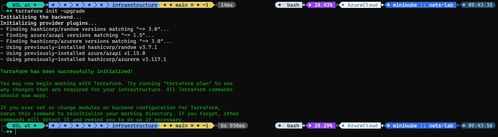

At first, a `terraform init` was executed, which allows downloading the providers that are going to be used to build the infrastructure (in this case, Azure).

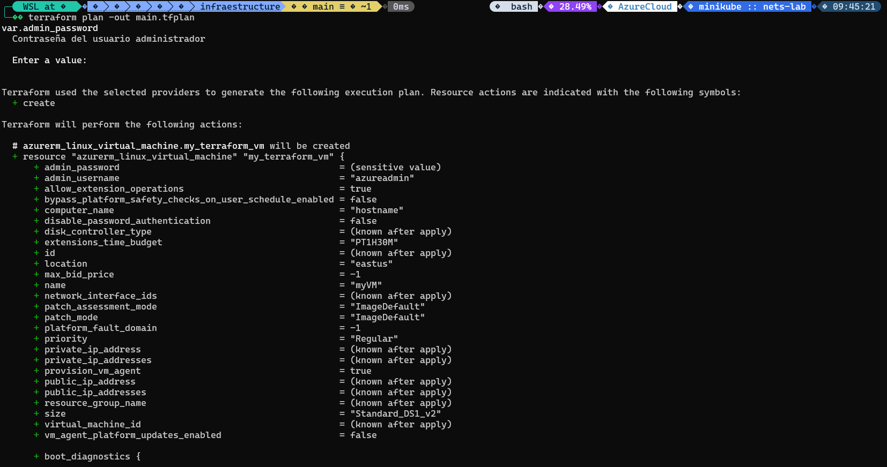

Then, a `terraform plan -out main.tfplan` was performed to verify that everything is correct and the infrastructure can be built.  

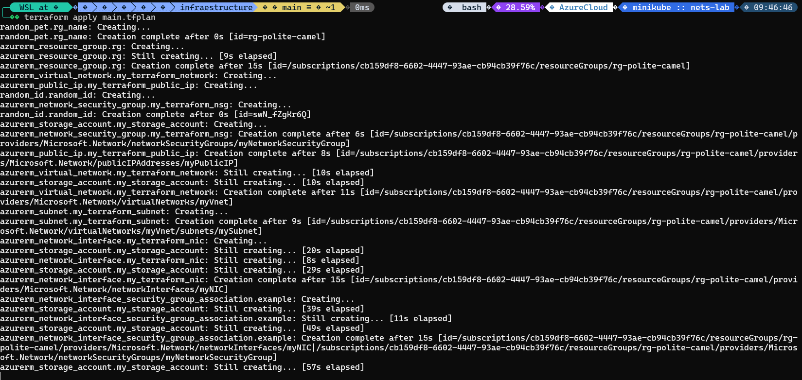

After that, `terraform apply main.tfplan` was executed, which applies and builds the infrastructure according to the plan that was made.

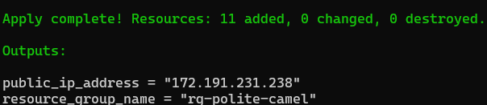

It can be seen that the infrastructure was built correctly, and the output provides the public IP address of the virtual machine and the name of the resource group.

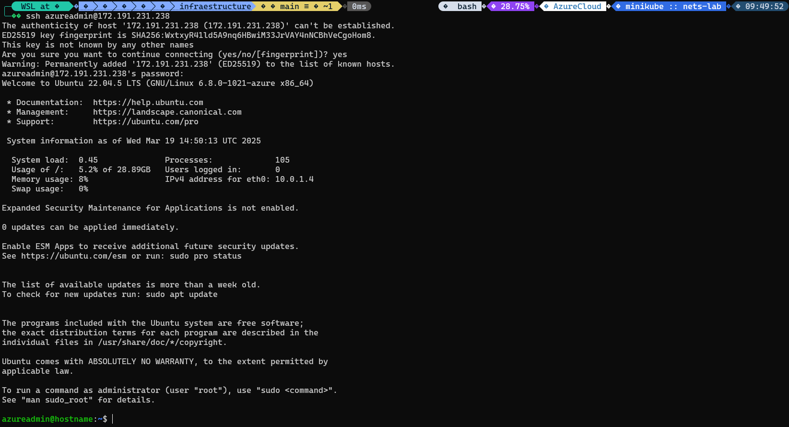

Then, the SSH connection was tested, and it was confirmed to be working correctly.

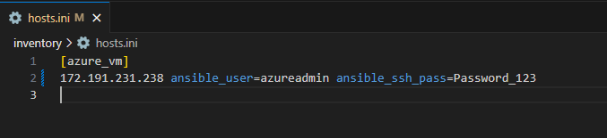

The hosts.ini IP address of the Azure machine was changed to allow Ansible to connect to the VM and make the necessary configurations.

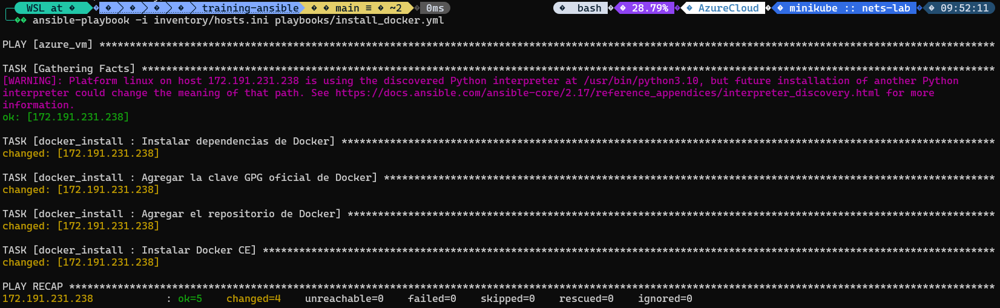

After that, `ansible-playbook -i inventory/hosts.ini playbooks/install_docker.yml` was executed. This executed the Ansible playbook that installs Docker in the VM, and it did so successfully.

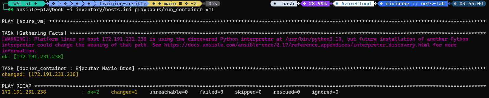

Then, another Ansible playbook was executed in the same way. The objective of `run_container.yml` was to create a Docker container that runs a Mario game and expose it on port 8787.

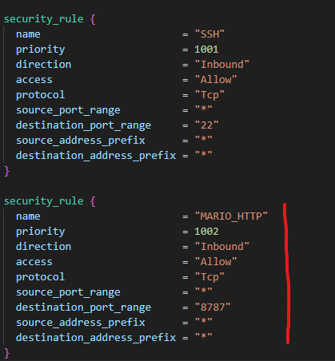

Then, another rule was created for the security group to allow HTTP traffic on port 8787, making the game available and accessible through the internet.

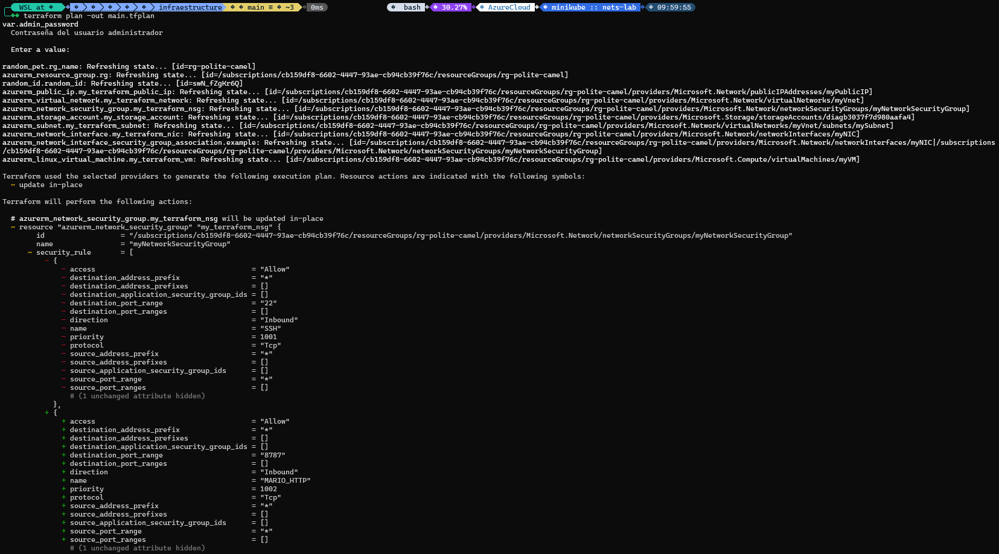
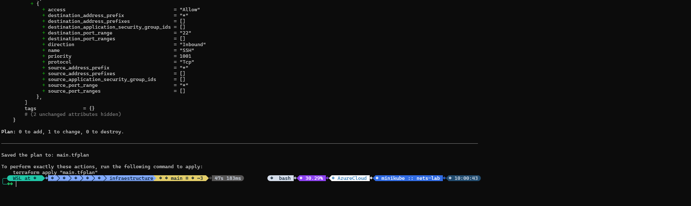

A `terraform plan` was made again, and it could be seen that the rest of the infrastructure would remain the same, with the only change being on the security group rules.

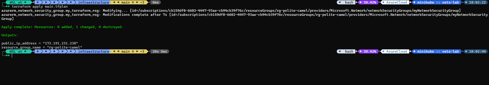

Then, `terraform apply` was successfully executed, which means that the rules of the security group were correctly changed.

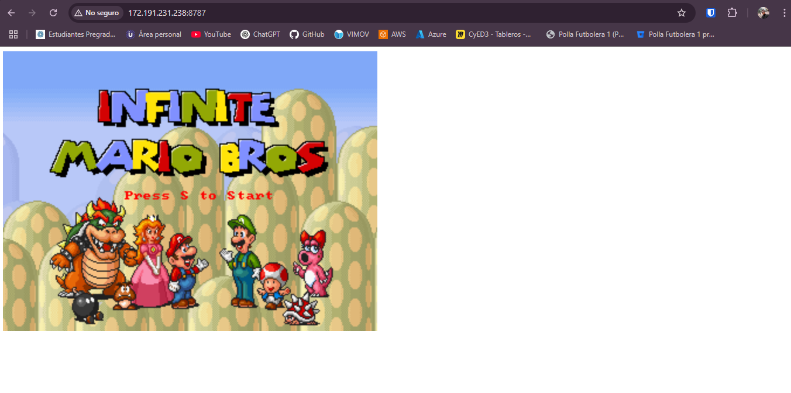

It was verified that the game was correctly deployed in the container and the port was accessible through the internet.

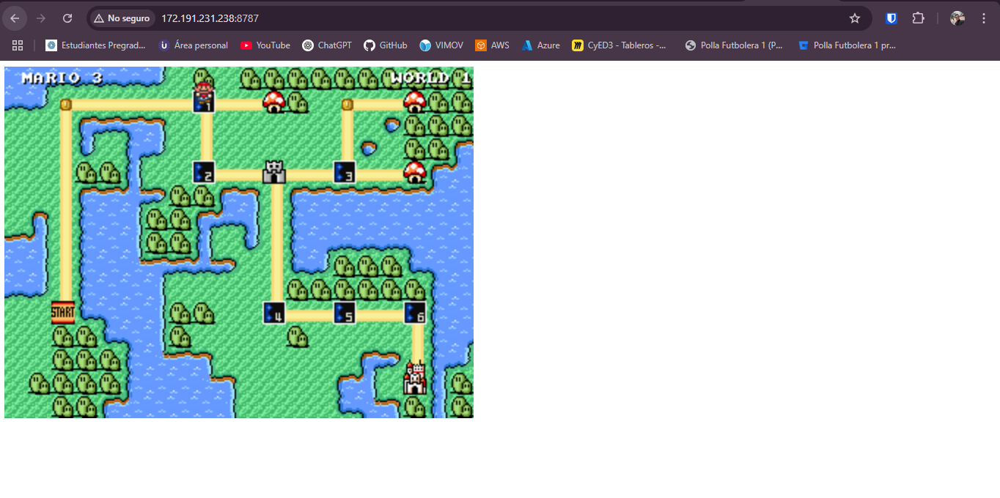

The game was playable and working correctly.

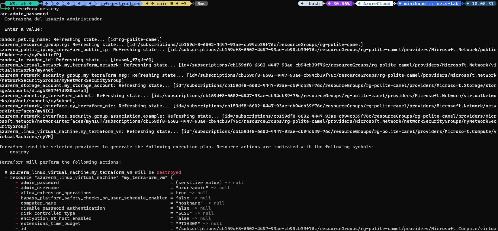

Finally, a `terraform destroy` was executed to delete all the infrastructure that was created in this exercise, so it would not generate more costs in the Azure account.

## Conclusion

IaC tools like Terraform allow engineers to set up infrastructure in a repeatable process that can be iterated when a change is needed, without changing everything else. These tools provide the possibility of versioning the different states of the infrastructure, and the infrastructure can be easily destroyed, allowing resources to be managed in an efficient way. On the other hand, Configuration Management tools like Ansible allow the creation of automated scripts (playbooks) that can quickly configure the infrastructure that is already set up, so engineers don't need to configure every machine individually and manually, as this process is automated.
